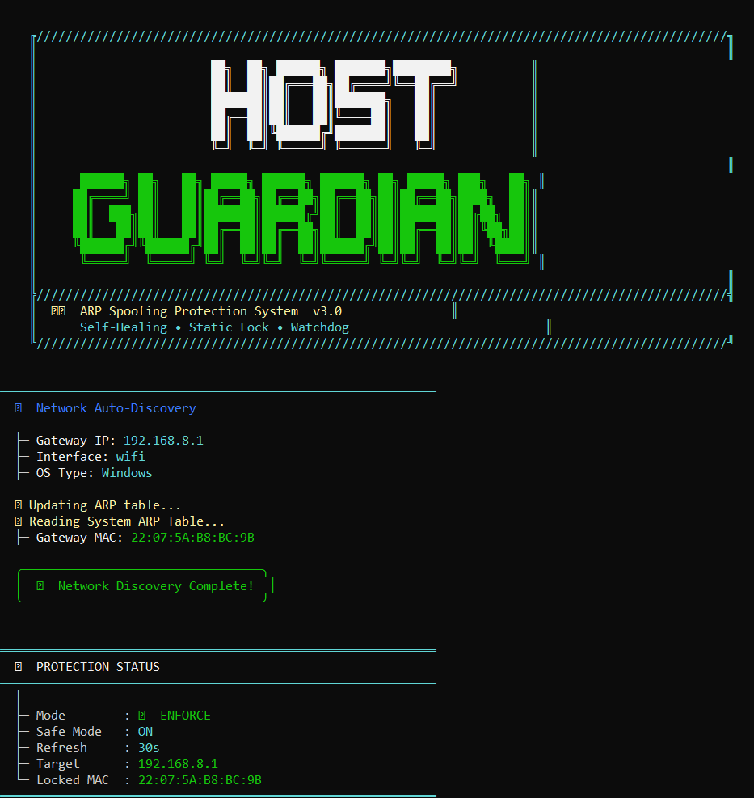

🛡️ Host Guardian

🔗Page Badges

A self-healing, host-based network protection agent designed to prevent ARP spoofing and Layer 2 Man-in-the-Middle (MITM) attacks.

🔍 Overview

Host Guardian is a host-based anti-ARP attack protection tool written in Python, designed as a learning and research project to deeply understand ARP behavior, MITM attacks, and practical defensive mechanisms.

The tool automatically:

Discovers the default gateway

Enforces kernel-level static ARP locking

Detects ARP spoofing attempts

Safely recovers from network instability using a self-healing mechanism

Host Guardian runs on both Windows and Linux, and relies on low-level OS networking commands combined with Scapy for packet inspection.

⚠️ This project was built primarily for educational and research purposes.

🛡️ Key Features

Automatic gateway discovery (IP & MAC)

Static ARP enforcement (Linux & Windows)

ARP spoofing detection (reply monitoring)

Self-healing safe rollback mechanism

Periodic hardening & ARP lock refresh

Cross-platform support

📋 Requirements

Python 3.x

Administrator / Root privileges
(Required for ARP table modification)

Scapy library

Install Scapy:

pip install scapy

🚀 How to Run
1️⃣ Running Host Guardian (Protection Tool)

This script runs on the host you want to protect.

🪟 Windows

Open Command Prompt or PowerShell as Administrator
(Right-click → Run as Administrator)

Navigate to the project directory:

cd path\to\Host-Guardian

Run the script:

python HostGuardian.py

🐧 Linux (Ubuntu / Kali)

Open Terminal

Run with sudo:

sudo python3 HostGuardian.py

⚙️ How It Works

Discovers the default gateway using OS routing tables

Resolves the gateway MAC address via ARP

Applies kernel-level static ARP locking

Monitors ARP traffic for spoofing attempts

Automatically unlocks and recovers if connectivity is lost

🧪 Intended Use Cases

Learning & research

SOC / Blue Team practice environments

Protecting sensitive hosts (Jump Boxes, forensic workstations)

Demonstrating host-based Layer 2 defense concepts

⚠️ Limitations

Designed for IPv4 networks only

Does not protect against attacks beyond Layer 2

Requires administrator/root privileges

Host-based protection (not network-wide)

📌 Project Status

Feature-complete
This project is no longer under active development and is considered a finished learning exercise.

### Bug Reports
This project is provided as-is for educational purposes.
Critical bug reports are welcome for documentation purposes, but no active development is planned.

📸 Screenshots

## 📄 License
MIT

